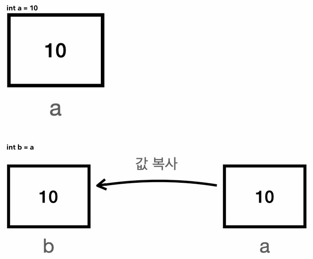
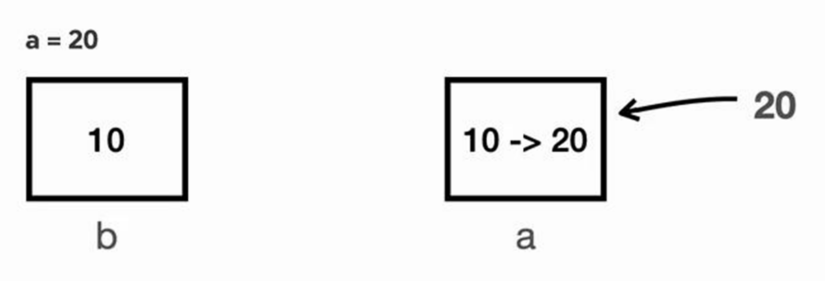
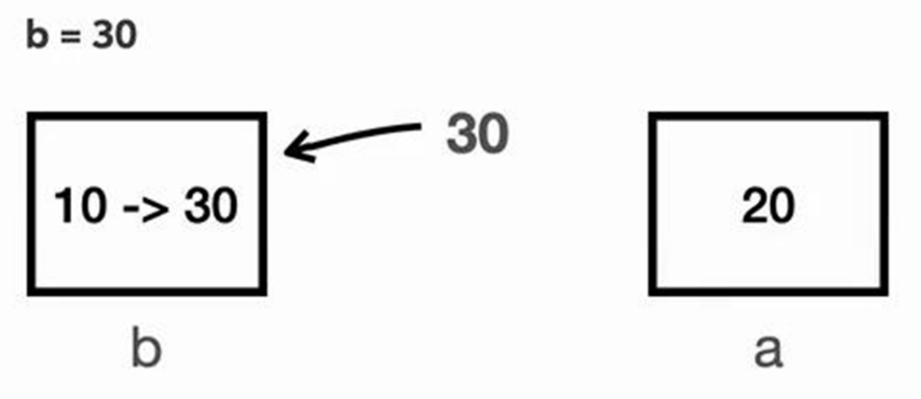
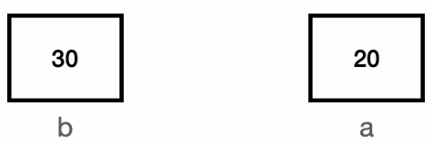
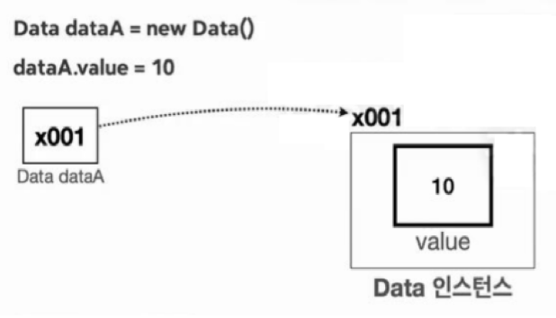
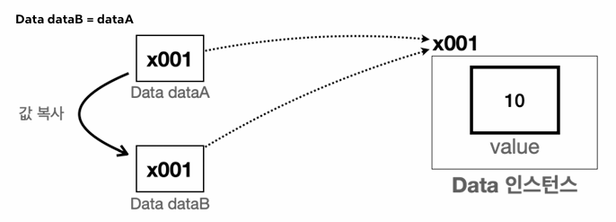
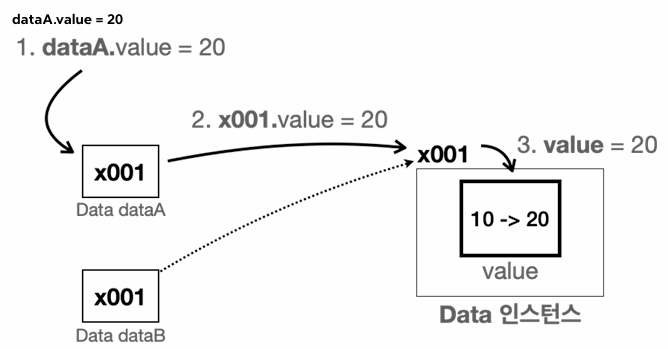
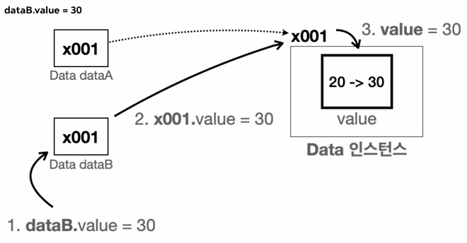

# [README.md](README.md)

# 기본형 vs 참조형1 - 시작 
<details>
<summary>접기/펼치기</summary>
<br>

**자바에서 참조형을 제대로 이해하는 것은 중요하다.**  
변수의 데이터 타입을 가장 크게 보면 기본형과 참조형으로 분류할 수 있다.  
사용하는 값을 변수에 직접 넣을 수 있는 **기본형**, 그리고 이전 섹션에서 본 `Student student1`과 같이  
객체가 저장된 메모리 위치를 가리키는 참조값을 넣을 수 있는 **참조형**으로 분류할 수 있다.  

- **기본형(Primitive Type):** `int`, `long`, `double`, `boolean` 처럼 변수에 사용할 값을 직접 넣을 수 있는 데이터 타입을 기본형이라 한다.  
- **참조형(Reference Type):** Student student1, int[] students와 같이 데이터에 접근하기 위한 참조(주소)를 저장하는 데이터 타입을 참조형이라 한다.  
  참조형은 객체 또는 배열에 사용된다.

쉽게 이야기해서 기본형 변수에는 직접 사용할 수 있는 값이 들어있지만 참조형 변수에는 위치(참조값)가 들어가 있다.  
참조형 변수를 통해서 뭔가 하려면 결국 참조값을 통해 해당 위치로 이동해야 한다.  

## 기본형 vs 참조형 - 기본
- 기본형은 숫자 `10`, `20`과 같이 실제 사용하는 값을 변수에 담을 수 있다.  
  그래서 해당 값을 바로 사용할 수 있다.  
- 참조형은 실제 사용하는 값을 변수에 담는 것이 아니다.  
  이름 그대로 실제 객체의 위치(참조, 주소)를 저장한다.    
  참조형에는 객체와 배열이 있다.  
  - 객체는 `.`(dot)를 통해서 메모리 상에 생성된 객체를 찾아가야 사용할 수 있다.  
  - 배열은 `[]`를 통해서 메모리 상에 생성된 배열을 찾아가야 사용할 수 있다.

## 기본형 vs 참조형 - 계산
- 기본형은 들어있는 값을 그대로 계산에 사용할 수 있다.  
  - 예) 더하기 빼기 등 (숫자 같은 것들은 바로 계산할 수 있음)
- 참조형은 들어있는 참조값을 그대로 사용할 수 없다.  
  주소만 가지고는 할 수 있는게 없다.  
  주소지에 가야 실체가 있다.
  - 예) 더하기 빼기등 사용불가.( 참조값만 가지고는 계산할 수 있는 것이 없음)

기본형은 연산이 가능하지만 참조형은 연산이 불가능하다.
```java
int a = 10, b = 20;
int sum = a + b;
```
기본형은변수에 실제 사용하는 값이 담겨있다. 따라서 `+`, `-`와 같은 연산이 가능하다.

```java
Student s1 = new Student();
Student s2 = new Student();
```
참조형은 변수에 객체의 위치인 참조값이 들어있다.  
참조값은 계산에 사용할 수 없다.  
따라서 오류가 발생한다.  

물론 아래와 같이 `.`을 통해 객체의 기본형 멤버 변수에 접근한 경우에는 연산을 할 수 있다.  
```java
Student s1 = new Student();
s1.grade = 100;
Student s2 = new Student();
s2.grade = 90;
int sum = s1.grade + s2.grade; // 연산 가능
```

### 쉽게 이해하는 팁
기본형을 제외한 나머지는 모두 모두 참조형이다.
- 기본형은 소문자로 시작한다. (`int`, `long`, `double`, `boolean` 모두 소문자)
  - 기본형은 자바가 기본적으로 제공하는 데이터 타입이다.  
    이러한 기본형은 개발자가 새로 정의할 수 없다.  
    개발자는 참조형인 클래스만 직접 정의할 수 있다.
- 클래스는 대문자로 시작한다. (`Student`)
  - 클래스는 모두 참조형이다.

### 참고 - String
자바에서 String은 특별하다.  
String은 사실은 클래스다.  
따라서 참조형이다.  
그런데 기본형처럼 문자 값을 바로 대입할 수 있다.  
문자는 매우 자주 다루기 때문에 자바에서특별하게 편의 기능을 제공한다.  
`String`에 대한 자세한 내용은 [김영한의 실전 자바 - 중급 1편](https://www.inflearn.com/course/%EA%B9%80%EC%98%81%ED%95%9C%EC%9D%98-%EC%8B%A4%EC%A0%84-%EC%9E%90%EB%B0%94-%EC%A4%91%EA%B8%89-1) 에서 다룬다.

</details>
<br>

# 기본형 vs 참조형2 - 변수 대입
<details>
<summary>접기/펼치기</summary>
<br>

**대원칙: 자바는 항상 변수의 값을 복사해서 대입한다.**
자바에서 변수에 값을 대입하는 것은 변수에 들어 있는 값을 복사해서 대입하는 것이다.  
기본형, 참조형 모두 항상 변수에 있는 값을 복사해서 대입한다.  
기본형이면 변수에 들어 있는 실제 사용하는 값을 복사해서 대입하고, 참조형이면 변수에 들어 있는 참조값을 복사해서 대입한다.

이 대원칙을 이해하면 복잡한 상황에도 코드를 단순하게 이해할 수 있다.

## 기본형 대입
```java
int a = 10;
int b = a;
``` 
변수 a에 있는 값 10을 복사해서 b에 대입한다.
a를 b에 대입하는것이 아닌 a의 값인 10을 b에 대입하는 것이다.

## 참조형 대입
```java
Student s1 = new Student(); // x001
Student s2 = s1;
```
s1에 있는 참조(주소)값 x001을 복사하여 s2에 대입한다.
기본형 대입과 마찬가지로 s2를 s1에 대입하는것이 아닌 s2의 주소값인 x001 을 s2에 대입하는 것이다.

기본형은 변수에 값을 대입하더라도 실제 사용하는 값이 변수에 바로 들어있기 때문에 해당 값만 복사해서 대입한다고 생각하면 쉽게 이해할 수 있다.  
반면 참조형의 경우 실제 사용하는 객체가 아니라 객체의 위치를 가리키는 참조값만 복사된다.  
쉽게 이야기해서 실제 건물이 복사가 되는 것이 아니라 건물의 위치인 주소만 복사되는 것이다.  
따라서 같은 건물을 찾아갈 수 있는 방법이 하나 늘어날 뿐이다.

## 기본형과 변수 대입
- [VarChange1.java](src%2Fref%2FVarChange1.java)
  ```java
  package ref;
  
  public class VarChange1 {
      public static void main(String[] args) {
          int a = 10;
          int b = a;
          System.out.println("a = " + a);
          System.out.println("b = " + b);
  
          // a 변경
          a = 20;
          System.out.println("변경 a = 20");
          System.out.println("a = " + a);
          System.out.println("b = " + b);
  
          // b 변경
          b = 30;
          System.out.println("변경 b = 30");
          System.out.println("a = " + a);
          System.out.println("b = " + b);
      }
  }
  ```

- 실행 결과
  ```
  a = 10
  b = 10
  변경 a = 20
  a = 20
  b = 10
  변경 b = 30
  a = 20
  b = 30
  ```
<br>

### 그림을 통한 이해

  
**실행 결과**
```java
a = 10
b = 10
```
변수의 대입은 변수에 들어있는 값을 복사해서 대입한다.  
여기서는 변수 `a`에 들어있는 값 `10`을 복사해서 변수 `b`에 대입한다.  
변수 `a`자체를 `b`에 대입하는 것이 아니다.

<br>


**실행 결과**
```java
a = 20
b = 10
```
변수 a에 값 20을 대입했다.  
따라서 변수 a의 값이 10에서 20으로 변경되었다.  
변수 b에는 아무런 영향을 주지 않는다.

<br>

  
**실행 결과**
```java
a = 20
b = 30
```
변수 `b`에 값 30을 대입했다.  
변수 `b`의 값이 `10`에서 `30`으로 변경되었다.  
변수 a에는 아무런 영향을 주지 않는다.

<br>

**최종 결과**  
  
핵심은 `int b = a` 라고 했을 때 변수에 들어있는 값을 복사해서 전달한다는 점이다.  
`a = 20`, `b = 30`이라고 했을 때 각각 본인의 값만 변경되는 것을 확인할 수 있다.

## 참조형과 변수 대입

- [Data.java](src%2Fref%2FData.java)
```java
  package ref;
  
  public class Data {
      int value;
  }
  ```
- [VarChange2.java](src%2Fref%2FVarChange2.java)
  ```java
  package ref;
  
  public class VarChange2 {
      public static void main(String[] args) {
          Data dataA = new Data();
          dataA.value = 10;
          Data dataB = dataA;
          System.out.println("dataA 참조값=" + dataA);
          System.out.println("dataB 참조값=" + dataB);
          System.out.println("dataA.value = " + dataA.value);
          System.out.println("dataB.value = " + dataB.value);
  
          // dataA 변경
          dataA.value = 20;
          System.out.println("변경 dataA.value = 20");
          System.out.println("dataA.value = " + dataA.value);
          System.out.println("dataB.value = " + dataB.value);
  
          // dataB 변경
          dataB.value = 30;
          System.out.println("변경 dataB.value = 30");
          System.out.println("dataA.value = " + dataA.value);
          System.out.println("dataB.value = " + dataB.value);
      }
  }
  ```
- **실행 결과**
  ```
  dataA 참조값=ref.Data@3419866c
  dataB 참조값=ref.Data@3419866c
  dataA.value = 10
  dataB.value = 10
  변경 dataA.value = 20
  dataA.value = 20
  dataB.value = 20
  변경 dataB.value = 30
  dataA.value = 30
  dataB.value = 30
  ```
<br>

### 그림을 통한 이해

dataA 변수는 Data 클래스를 통해 만들었기 때문에 참조형으로 Data형 객체의 참조값을 저장한다.  
Data객체를 생성하고, 참조값을 dataA에 저장한 후 객체의 value 변수에 값 10을 저장했다.

<br>


- **실행 코드**
  ```java
  Data dataB = dataA;
  System.out.println("dataA 참조값=" + dataA);
  System.out.println("dataB 참조값=" + dataB);
  System.out.println("dataA.value = " + dataA.value);
  System.out.println("dataB.value = " + dataB.value);
  ```

- **실행 결과**
  ```
  dataA 참조값=ref.Data@x001
  dataB 참조값=ref.Data@x001
  dataA.value = 10
  dataB.value = 10
  ```
  변수의 대입은 변수에 들어있는 값을 복사해서 대입하기 때문에 변수 dataA에는 참조값 x001이 들어있고, 해당 값을 복사하여 변수 dataB에 대입한다.  
  변수 dataA가 가르키는 인스턴스를 복사하는 것이 아닌 변수에 들어있는 참조값만 복사해서 전달한다.  
  dataA와 dataB에 들어있는 참조값은 같으며, 둘 다 같은 x001 Data 인스턴스를 가리킨다.

<br>


- **실행 코드**
  ```java
  dataA.value = 20;
  System.out.println("dataA.value = " + dataA.value);
  System.out.println("dataB.value = " + dataB.value);
  ```

- **실행 결과**
  ```
  dataA.value = 20
  dataB.value = 20
  ```
  `dataA.value = 20` 코드 실행시 dataA가 가리키는 x001 인스턴스의 value 값을 10에서 20으로 변경한다.  
  dataA와 dataB는 같은 x001 인스턴스를 참조하기 때문에 dataA.value와 dataB.value는 동일한 값인 20을 출력한다.

<br>


- **실행 코드**
  ```java
  dataA.value = 30;
  System.out.println("dataA.value = " + dataA.value);
  System.out.println("dataB.value = " + dataB.value);
  ```
- **실행 결과**
  ```
  a = 30
  b = 30
  ```
  dataB.value = 30 코드 실행시 dataB가 가리키는 x001 인스턴스의 value값을 20에서 30으로 변경한다.  
  dataA와 dataB는 같은 x001 인스턴스를 참조하기 때문에 dataA.value와 dataB.value는 동일한 값인 30을 출력한다.

  두가지 핵심 포인트는 `Data dataB = dataA`라고 했을 때 변수에 들어있는 값을 `복사`해서 사용한다는 점이며, 해당 값은 `참조값` 이라는 점이다.  
  dataA와 dataB는 같은 참조값을 가지게 되고, 두 변수는 같은 인스턴스 객체를 참조하게 된다.

</details>
<br>

# 템플릿
<details>
<summary>접기/펼치기</summary>
<br>


##
<details>
<summary>접기/펼치기</summary>
<br>


</details>
<br>

</details>
<br>