# [README.md](README.md)

# 클래스가 필요한 이유
<details>
<summary>접기/펼치기</summary>
<br>

자바는 클래스와 객체로 이루어져 있다.  
그만큼 클래스와 객체라는 개념은 중요하다.  
그런데 클래스와 객체는 너무 많은 내용을 포함하고 있어 한번에 이해하기가 쉽지 않다.

## 문제: 학생 정보 출력 프로그램

- 요구사항
  1. 첫 번째 학생 이름은 "학생1", 나이는 15, 성적은 90이다.
  2. 두 번째 학생 이름은 "학생2", 나이는 16, 성적은 80이다.
  3. 각 학생의 정보를 다음과 같은 형식으로 출력해야 한다.
     `이름: [이름] 나이: [나이] 성적: [성적]`
  4. 변수를 사용하여 학생 정보를 저장하고 변수를 사용하여 학생 정보를 출력해야 한다.
- 예시 출력
  ```
  이름:학생1 나이:15 점수:90
  이름:학생2 나이:16 점수:80
  ```
- 풀이: [ClassStart1.java](src%2Fclass1%2FClassStart1.java)
  ```java
  package class1;

  public class ClassStart1 {
  public static void main(String[] args) {
  String student1Name = "학생1";
  int student1Age = 15;
  int student1Grade = 90;
  
          String student2Name = "학생2";
          int student2Age = 16;
          int student2Grade = 80;
  
          System.out.println("이름:" + student1Name + " 나이:" + student1Age + " 점수:" + student1Grade);
          System.out.println("이름:" + student2Name + " 나이:" + student2Age + " 점수:" + student2Grade);
      }
  }
  ```

  학생 2명을 다뤄야 하기 때문에 각각 다른 변수를 사용했다.  
  코드의 문제는 학생이 늘어날 때 마다 변수를 추가로 선언해야 하고, 또 출력하는 코드도 추가해야 한다.
  ```java
  package class1;

  public class ClassStart1 {
      public static void main(String[] args) {
          String student1Name = "학생1";
          int student1Age = 15;
          int student1Grade = 90;
  
          String student2Name = "학생2";
          int student2Age = 16;
          int student2Grade = 80;
  
          String student2Name = "학생3";
          int student2Age = 17;
          int student2Grade = 70;
    
          System.out.println("이름:" + student1Name + " 나이:" + student1Age + " 점수:" + student1Grade);
          System.out.println("이름:" + student2Name + " 나이:" + student2Age + " 점수:" + student2Grade);
          System.out.println("이름:" + student3Name + " 나이:" + student3Age + " 점수:" + student3Grade);
      }
  }
  ```
  해당 문제점은 배열을 사용하면 해결할 수 있다.

### 배열 사용
- 학생 추가 전
  ```java
  package class1;

  public class ClassStart2 {
      public static void main(String[] args) {
          String[] studentNames = {"학생1", "학생2"};
          int[] studentAges = {15, 16};
          int[] studentGrades = {90, 80};
          for (int i = 0; i < studentNames.length; i++) {
              System.out.println("이름:" + studentNames[i] + " 나이:" + studentAges[i] + " 점수:" + studentGrades[i]);
          }
      }
  }
  ```
  배열을 사용한 덕분에 학생이 추가되어도 배열에 학생의 데이터만 추가하면 된다.  
  이제 변수를 더 추가하지 않아도 되고, 출력 부분의 코드도 그대로 유지할 수 있다.
- 학생 추가 후
  ```java
  package class1;

  public class ClassStart2 {
      public static void main(String[] args) {
          String[] studentNames = {"학생1", "학생2", "학생3"};
          int[] studentAges = {15, 16, 17};
          int[] studentGrades = {90, 80, 70};
          for (int i = 0; i < studentNames.length; i++) {
              System.out.println("이름:" + studentNames[i] + " 나이:" + studentAges[i] + " 점수:" + studentGrades[i]);
          }
      }
  }
  ```
### 배열 사용의 한계
배열을 사용해서 코드 변경을 최소화 하는데는 성공했지만, 한 학생의 데이터가 studentNames[], studentAges[], studentGrades[] 라는 3개의 배열에 나누어져 있다.    
따라서 데이터를 변경할 때 매우 조심해서 작업해야 한다.  
예를 들어 학생2의 데이터를 제거하려면 각각의 배열마다 학생2의 요소를 정확하게 찾아서 제거해줘야 한다.

한 학생의 데이터가 3개의 배열에 나누어져있기 땜누에 3개의 배열을 각각 변경해야 한다.  
또한 한 학생의 데이터를 관리하기 위해 3개 배열의 인덱스 순서를 항상 정확하게 맞추어야 한다.  
이렇게 하면 특정 학생의 데이터를 변경할 때 실수할 가능성이 매우 높다.  
배열을 활용한 위 코드는 컴퓨터가 볼 때는 아무 문제가 없지만, 사람이 관리하기에는 좋은 코드가 아니다.

#### 정리
위와 같이 배열을 활용하여 이름, 나이, 성적을 각각 따로 나누어서 관리하는 것은 사람이 관리하기 좋은 방식이 아니다.  
사람이 관리하기 좋은 방식은 학생이라는 개념을 하나로 묶는것이다.  
그리고 각각의 핵생 별로 본인의 이름, 나이, 성적을 관리하는 것이다.
<br>

</details>
<br>

# 클래스 도입
<details>
<summary>접기/펼치기</summary>
<br>

클래스를 사용해서 학생이라는 개념을 만들고, 각각의 학생 별로 본인의 이름, 나이, 성적을 관리한다.

## [Student.java](src%2Fclass1%2FStudent.java) 클래스
```java
public class Student {
    String name;
    int age;
    int grade;
}
```
class 키워드를 사용해서 학생 클래스(Student)를 정의한다.  
학생 클래스는 내부에 이름(name), 나이(age), 성적(grade) 변수를 가진다.

이렇게 클래스에 정의한 변수들을 멤버 변수, 또는 필드라 한다.
- 멤버 변수(Member Variable): 이 변수들은 특정 클래스에 소속된 `멤버`이기 때문에 `멤버 변수`라고 부른다.
- 필드(Field): 데이터 항목을 가리키는 정통적인 용어이다. 데이터베이스, 액셀 등에서 데이터 각각의 항목을 필드라 한다.
- 자바에서 멤버 변수, 필드는 같은 뜻이다. 클래스에 소속된 변수를 뜻한다.

### 클래스는 관례상 대문자로 시작하고 낙타표기법을 사용한다.
이를 파스칼 표기법이라 한다.  
예) Student, User, MemberService

## 학생 클래스 활용
- [ClassStart3.java](src%2Fclass1%2FClassStart3.java)
  ```java
  public class ClassStart3 {
      public static void main(String[] args) {
  
          Student student1;
          student1 = new Student(); // 객체, 인스턴스: 학생 클래스를 실제 메모리에 만들고 변수에 할당한다.
          /* .을 통해 필드 접근 및 값 할당 */
          student1.name = "학생1";
          student1.age = 15;
          student1.grade = 90;
  
          Student student2;
          student2 = new Student(); // 객체, 인스턴스: 학생 클래스를 실제 메모리에 만들고 변수에 할당한다.
          /* .을 통해 필드 접근 및 값 할당 */
          student2.name = "학생2";
          student2.age = 16;
          student2.grade = 80;
  
          Student student3;
          student3 = new Student(); // 객체, 인스턴스: 학생 클래스를 실제 메모리에 만들고 변수에 할당한다.
          /* .을 통해 필드 접근 및 값 할당 */
          student3.name = "학생2";
          student3.age = 17;
          student3.grade = 70;
          System.out.println("이름:" + student1.name + " 나이:" + student1.age + " 점수:" + student1.grade);
          System.out.println("이름:" + student2.name + " 나이:" + student2.age + " 점수:" + student2.grade);
          System.out.println("이름:" + student3.name + " 나이:" + student3.age + " 점수:" + student3.grade);
      }
  }
  ```
- 실행 결과
  ```
  이름:학생1 나이:15 성적:90
  이름:학생2 나이:16 성적:80
  이름:학생3 나이:17 성적:70
  ```
### 클래스와 사용자 정의 타입
- 타입은 데이터의 종류나 형태를 나타낸다.
- int라고 하면 정수 타입, String이라고 하면 문자 타입이다.
- 학생(Student)이라는 타입을 만들면 되지 않을까?
- 클래스를 사용하면 int, String과 같은 타입을 직접 만들 수 있다.
- 사용자가 직접 정의하는 사용자 정의 타입을 만들려면 설계도가 필요하며 자바에서는 *설계도*가 바로 **클래스**이다.
- 설계도인 클래스를 사용해서 *실제 메모리에 만들어진 실체*를 **객체** 또는 **인스턴스**라 한다.
- 클래스를 통해서 사용자가 원하는 종류의 데이터 타입을 마음껏 정의할 수 있다.

### 용어: 클래스, 객체, 인스턴스
클래스는 설계도이고, 이 설계도를 기반으로 실제 메모리에 만들어진 실체를 객체 또는 인스턴스라 한다.  
둘 다 같은 의미로 사용된다.  
여기서 학생(Student)클래스를 기반으로 학생1(student1), 학생2(student2) 객체 또는 인스턴스를 만들었다.

## 코드 분석

### 1. 변수 선언
#### Student student1 // Student 변수 선언
 (변수 공간 할당)
- `Student student1`
  - Student 타입을 받을 수 있는 변수를 선언하다.
  - int는 정수를, String은 문자를 담을 수 있듯이 Student는 Student 타입의 객체(인스턴스)를 받을 수 있다.

### 2. 객체 생성
#### Studnet1 = new Student() // Student 인스턴스 생성
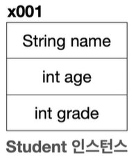 (메모리 공간 확보)

- `Student1 = new Student()`
  - 객체를 사용하려면 먼저 설계도인 클래스를 기반으로 객체(인스턴스)를 생성해야 한다.
  - `new Student()`: `new`는 새로 생성한다는 뜻이다.
    - `new Student()`는 `Student` 클래스 정보를 기반으로 새로운 객체를 생성하라는 뜻이다.
    - 이렇게 하면메모리에 실제 `Student` 객체(인스턴스)를 생성해야 한다.
  - 객체를 생성할 때는 `new 클래스명()`을 사용하면 된다. 마지막에 `()`도 추가해야 한다.
  - `Student` 클래스는 `String name`, `int age`, `int grade` 멤버 변수를 가지고 있다.
    - 이 변수를 사용하는 데 필요한 메모리 공간도 함께 확보된다.
### 3. 참조값 보관
#### Studnet1 = x001 // Student 인스턴스 참조값 보관
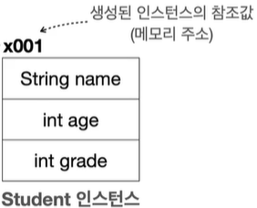
- 객체를 생성하면 자바는 메모리 어딘가에 있는 이 객체에 접근할 수 있는 참조값(주소-`x100`)을 반환한다.
  - `x100` 이라고 표현한 것이 참조값이다. (실제로 x001처럼 표현되는 것은 아니고 이해를 돕기 위한 예시이다.)
- `new` 키워드를 통해 객체가 생성되고 나면 참조값을 반환한다.  
  앞서 선언한 변수인 Student student1에 생성된 객체의 참조값(`x100`)을 보관한다.
  - student1 변수는 방금 만든 객체에 접근할 수 있는 참조값을 가지고 있다.  
    따라서 이 변수를 통해서 객체를 접근(참조)할 수 있다.  
    쉽게 말해 student1 변수를 통해 메모리에 있는 실제 객체를 접근하고 사용할 수 있다.

### 참조값을 변수에 보관해야 하는 이유
객체를 생성하는 new Student() 코드 자체에는 아무런 이름이 없다.  
이 코드는 단순히 Student 클래스를 기반으로 메모리에 실제 객체를 만드는 것이다.  
따라서 생성한 객체에 접근할 수 있는 방법이 필요하다.  
이런 이유로 객체를 생성할 때 반환되는 참조값을 어딘가에 보관해두어야 한다.  
앞서 Student student1 변수에 참조값(`x001`)을 저장해두었으므로 저장한 참조값(`x001`)을 통해서 실제 메모리에 존재하는 객체에 접근할 수 있다.

```java
Student student1 = new Student(); // 1. Student 객체 생성
Student student1 = x001; // 2. new Student()의 결과로 x001 참조값 반환
student1 = x001; // 3. 최종 결과
```
이후 학생 (student2)까지 생성하면 다음과 같이 Student 객체(인스턴스)가 메모리에 2개 생성된다.  
각각 참조값이 다르므로 서로 구분할 수 있다.  
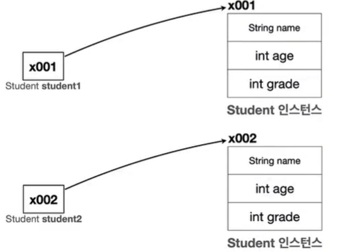

참조값을 확인하고 싶다면 다음과 같이 객체를 담고 있는 변수를 출력해보면 된다.
```java
System.out.println(student1);
System.out.println(student2);
```

**출력 결과**
```
class1.Student@66a29884
class1.Student@4769b07b
```
</details>
<br>

# 객체 사용
<details>
<summary>접기/펼치기</summary>
<br>


클래스를 통해 생성한 객체를 사용하려면 먼저 메모리에 존재하는 객체에 접근해야 한다.    
객체에 접근하려면 `.` (점 dot)을 사용하면 된다.

```java
student1.name = "학생1";
student1.age = 15;
student1.grade = 90;

System.out.println("이름:" + student1.name + " 나이:" + student1.age + " 점수:" + student1.grade);
```
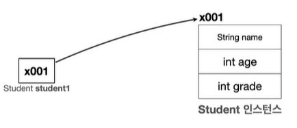 (객체 참조)

### 객체에 값 대입
객체가 가지고 있는 멤버 변수(`name`, `age`, `grade`)에 값을 대입하려면 먼저 객체에 접근해야 한다.
객체에 접근하려면 `.`(점 dot)키워드를 사용하면 된다.  
이 키워드는 변수(`student1`)에 들어있는 참조값(`x001`)을 읽어서 메모리에 존재하는 객체에 접근한다.

순서를 풀어보려면 다음과 같다.
```java
student1.name = "학생1" // 1. student1 객체의 name 멤버 변수에 값 대입
x001.name = "학생1" // 2. 변수에 있는 참조값을 통해 실제 객체에 접근, 해당 객체의 name 멤버 변수에 값 대입
```

#### 그림으로 이해
`student1.name = "학생"` **코드 실행 전**

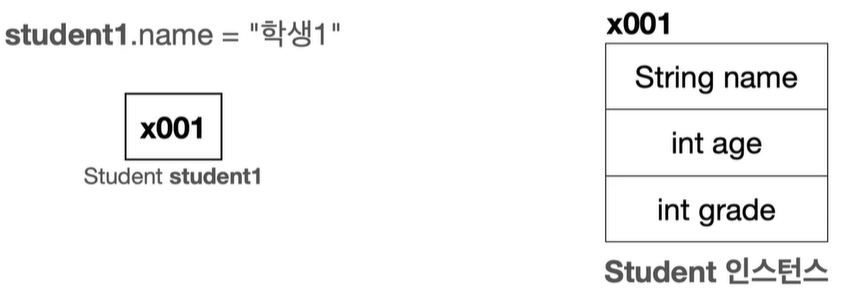

`student1.name = "학생"` **코드 실행 후**

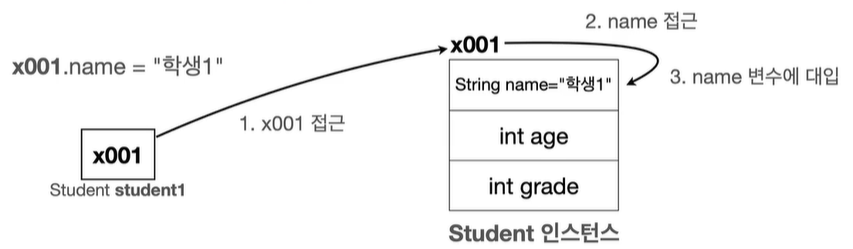

- `student1.name`코드를 통해 `.`(dot) 키워드가 사용되었다. `student1` 변수가 가지고 있는 참조값을 통해 실제 객체에 접근한다.
- `x001.name = "학생"`:`x001` 객체가 있는 곳의 `name` 멤버 변수에 "학생" 데이터가 저장된다.

### 객체 값 읽기

```java
// 1. 객체 값 읽기
System.out.println("이름:" + student1.name);
// 2. 변수에 있는 참조값을 통해 실제 객체에 접근하고, name 멤버 변수에 접근한다.
System.out.println("이름:" + x001.name);
// 3. 객체의 멤버 변수의 값을 읽어옴
System.out.println("이름:" + "학생1");
```

#### 그림1.

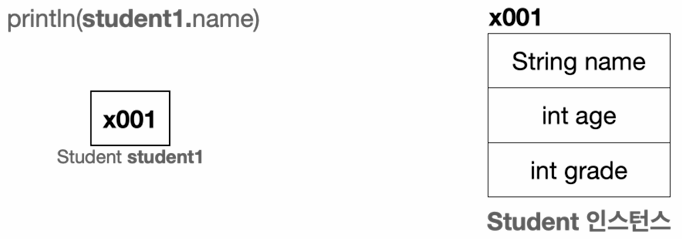

#### 그림2.

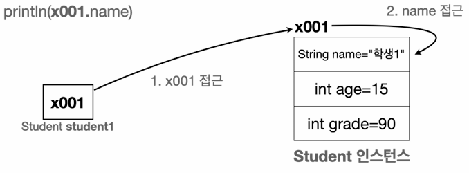

x001에 있는 Student 인스턴스의 name 멤버 변수는 "학생1"이라는 값을 가지고 있다.  
이 값을 읽어서 사용한다.

</details>
<br>

# 클래스, 객체, 인스턴스 정리
<details>
<summary>접기/펼치기</summary>
<br>

## 클래스 - class
클래스는 객체를 생성하기 위한 `틀` 또는 `설계도` 이다.  
클래스는 객체가 가져야 할 속성(변수)와 기능(메소드)를 정의한다.  
예를들어 학생이라는 클래스는 속성으로 name, age, grade를 가진다.  
(메소드는 객체 지향 프로그래밍 파트에서 다루며, 지금은 속성(변수)에 대해 집중한다.)  

- **틀**: 붕어빵 틀을 예를 들어 생각해 본다.  
  붕어빵 틀은 붕어빵이 아니라 붕어 모양으로 빵을 만드는 틀 일 뿐이다.
  실제로 먹을 수 있는 팥 붕어빵을 `객체` 또는 `인스턴스` 라고 한다.
- **설계도**: 자동차 설계도를 예를 들어 생각해 본다.    
  설계도는 실제 존재하는 것이 아니라 개념으로만 있는 것으로 설계도를 통해 자동차를 생산한다.  
  실제 존재하는 흰색 테슬라 모델 Y 자동차를 `객체` 또는 `인스턴스` 라고 한다.

## 객체 - Object
객체는 클래스에서 정의한 `속성과 기능을 가진 실체`이다.  
객체는 `서로 독립적인 상태`를 가진다.  
객체 사용의 코드를 예를 들어 `student1`은 학생1의 속성을 가지는 객체이고, `student2`는 학생2의 속성을 가지는 객체이다.  
`student1`과 `student2`는 같은 클래스에서 만들어졌지만, 서로 다른 객체이다.  

## 인스턴스 - Instance
인스턴스는 특정 클래스로부터 생성된 객체를 의미한다.  
그래서 객체와 인스턴스라는 용어는 자주 혼용된다.  
인스턴스는 주로 객체가 어떤 클래스에 속해 있는지 강조할 때 사용한다.  
예를들어 `student1 객체`는 `Student 클래스의 인스턴스`다. 라고 표현한다.

## 객체 vs 인스턴스
두 개념 모두 클래스에서 나온 실체라는 의미에서 비슷하게 사용되지만, 용어상 인스턴스는 객체보다 좀 더 `관계`에 초점을 맞춘 단어이다.  
보통 `student1`은 `Student`의 객체이다. 라고 말하는 대신 `student1`은 `Student`의 인스턴스이다. 라고 `특정 클래스와의 관계를 명확히 할 때 인스턴스`라는 용어를 주로 사용한다.  
좀 더 쉽게 풀어보자면, 모든 인스턴스는 객체이지만, 인스턴스라고 부르는 순간은 특정 클래스로부터 그 객체가 생성되었음을 강조하고 싶을 때이다.  
예를 들어 `student1`은 객체이지만, 이 객체가 `Student` 클래스로부터 생성된다는 점을 명확히 하기 위해 `student1`을 `Student`의 인스턴스라고 부른다.  

하지만 둘다 클래스에서 나온 실체라는 핵심 의미는 같기 때문에 보통 둘을 구분하지 않고 사용한다.  

</details>
<br>

# 배열 도입 - 시작
<details>
<summary>접기/펼치기</summary>
<br>

- [ClassStart3.java](src%2Fclass1%2FClassStart3.java)
  ```java
  package class1;
  
  public class ClassStart3 {
    public static void main(String[] args) {
      Student student1;
      student1 = new Student(); // 학생 클래스를 실제 메모리에 만들고 변수에 할당한다.
      /* .을 통해 필드 접근 및 값 할당 */
      student1.name = "학생1";
      student1.age = 15;
      student1.grade = 90;

      Student student2;
      student2 = new Student(); // 학생 클래스를 실제 메모리에 만들고 변수에 할당한다.
      /* .을 통해 필드 접근 및 값 할당 */
      student2.name = "학생2";
      student2.age = 16;
      student2.grade = 80;

      Student student3;
      student3 = new Student(); // 학생 클래스를 실제 메모리에 만들고 변수에 할당한다.
      /* .을 통해 필드 접근 및 값 할당 */
      student3.name = "학생2";
      student3.age = 17;
      student3.grade = 70;
      System.out.println("이름:" + student1.name + " 나이:" + student1.age + " 점수:" + student1.grade);
      System.out.println("이름:" + student2.name + " 나이:" + student2.age + " 점수:" + student2.grade);
      System.out.println("이름:" + student3.name + " 나이:" + student3.age + " 점수:" + student3.grade);

      System.out.println("student1 = " + student1);
      System.out.println("student2 = " + student2);
      System.out.println("student3 = " + student3);
    }
  }
  ```
클래스를 도입하고 객체를 사용한 덕분에 학생에 대한 데이터를 구조적으로 이해하기 쉽게 변경할 수 있었다.  
마치 실제 학생이 있고, 그 안에 각 학생의 정보가 있는 것 같다.  
따라서 사람이 이해하기도 편리하다.  
각각의 학생 별로 객체를 생성하고, 해당 객체에 학생의 데이터를 관리하면 된다.

하지만 코드를 보면 아쉬운 부분이 있는데, 바로 학생을 출력하는 부분이다.  
```java
System.out.println("이름:" + student1.name + " 나이:" + student1.age + " 점수:" + student1.grade);
System.out.println("이름:" + student2.name + " 나이:" + student2.age + " 점수:" + student2.grade);
System.out.println("이름:" + student3.name + " 나이:" + student3.age + " 점수:" + student3.grade);
```
새로운 학생이 추가될 때 마다 출력하는 부분도 함께 추가해야 한다.  

배열을 사용하면 특정 타입을 연속한 데이터 구조로 묶어서 편리하게 관리할 수 있다.  
`Student` 클래스를 사용한 변수들도 `Student` 타입이기 때문에 학생도 배열을 사용해서 하나의 데이터 구조로 묶어서 관리할 수 있다.  

### 배열 도입
- [ClassStart4.java](src%2Fclass1%2FClassStart4.java)
  ```java
  package class1;

  public class ClassStart4 {
    public static void main(String[] args) {
      Student student1 = new Student(); // 학생 클래스를 실제 메모리에 만들고 변수에 할당한다.
      /* .을 통해 필드 접근 및 값 할당 */
      student1.name = "학생1";
      student1.age = 15;
      student1.grade = 90;

      Student student2 = new Student(); // 학생 클래스를 실제 메모리에 만들고 변수에 할당한다.
      /* .을 통해 필드 접근 및 값 할당 */
      student2.name = "학생2";
      student2.age = 16;
      student2.grade = 80;


      /* Student 배열 생성 */
      Student[] students = new Student[2];
      /* 각 인덱스에 접근하여 stduent 객체 할당 */
      students[0] = student1;
      students[1] = student2;

      System.out.println("이름:" + students[0].name + " 나이:" + students[0].age + " 점수:" + students[0].grade);
      System.out.println("이름:" + students[1].name + " 나이:" + students[1].age + " 점수:" + students[1].grade);
    }
  }
  ```
### 코드 분석

#### 코드 분석 1. Student 클래스 기반으로 student1, student2 인스턴스를 생성한 후 필요한 값을 할당한다.
```java
Student student1 = new Student(); // 학생 클래스를 실제 메모리에 만들고 변수에 할당한다.
/* .을 통해 필드 접근 및 값 할당 */
student1.name = "학생1";
student1.age = 15;
student1.grade = 90;

Student student2= new Student(); // 학생 클래스를 실제 메모리에 만들고 변수에 할당한다.
/* .을 통해 필드 접근 및 값 할당 */
student2.name = "학생2";
student2.age = 16;
student2.grade = 80;
```

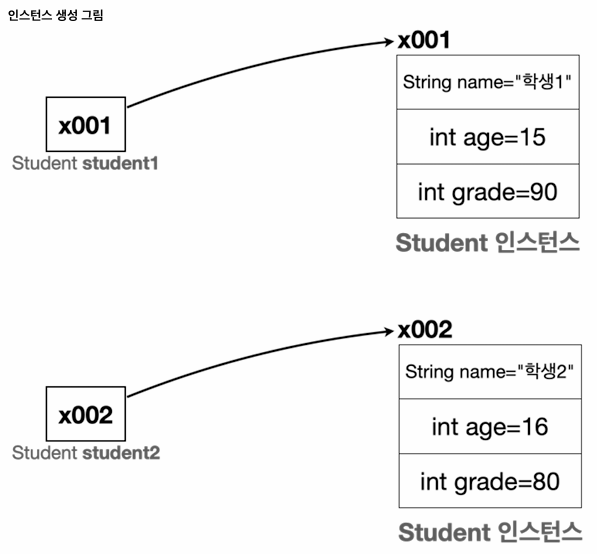


#### 코드 분석 2. 배열에 참조 값 대입
Student를 답을 수 있는 배열을 생성하고, 해당 배열에 student1, student2 인스턴스를 보관한다.
```java
Student[] students = new Student[2];
```


- Student 변수를 2개 보관할 수 있는 사이즈 2의 배열을 만든다.  
- Student 타입의 변수는 Student 인스턴스의 참조값(주소)을 보관한다.  
  Student 배열의 각각의 항목도 Student 타입의 변수일 뿐이다.  
  따라서 Student 타입의 참조값을 보관한다.
  - `student1`, `student2` 변수를 생각해보면 Student 타입의 참조값을 보관한다.
- 배열에는 아직 참조값을 대입하지 않았기 때문에 참조값이 없다는 의미의 `null` 값으로 초기화 된다.

다음으로 아래와 같이 배열에 객체를 보관한다.
```java
students[0] = student1;
students[1] = student2;
```

<details>
<summary>[클릭] 자바에서 대입은 항상 변수에 들어있는 값을 복사하여 전달한다.</summary>  

자바에서 변수의 대입(=)은 모든 변수에 들어있는 값을 복사해서 전달하는 것이다.    
위 코드에서 오른쪽 변수인 `student1`, `student2`에는 참조값이 들어있다.  
이 참조값을 복사해서 왼쪽에 있는 배열에 전달한다.  
따라서 기존 `student1`, `student2`에 들어있던 참조값은 당연히 그대로 유지된다.

**주의!**
변수에는 인스턴스 자체가 들어있는 것이 아니다!  
인스턴스의 위치를 가리키는 참조값이 들어있을 뿐이다!  
따라서 대입(=)시에 인스턴스가 복사되는 것이 아니라 참조값만 복사된다.

</details>

```java
students[0] = x001;
students[1] = x002;
```

`student1`, `student2`에는 참조값이 보관되어 있다.  
따라서 참조값이 배열에 저장된다.  
(또는 `student1`, `student2`에 보관된 참조값을 읽고 복사해서 배열에 대입한다고 표현한다.)

<br>

**배열에 참조값을 대입한 이후 배열 그림**  
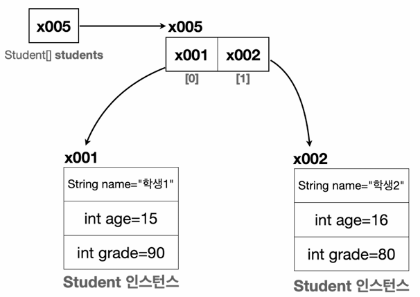  

이제 배열(x005)는 x001, x002의 참조값을 가진다.  
참조값을 가지고 있기 때문에 `Student` 인스턴스 `x001(학생1)`, `x002(학생2)`에 모두 접근할 수 있다.

<br>

**배열에 참조값을 대입한 이후 최종 그림**  
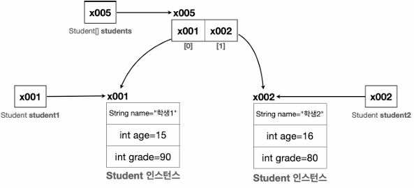


### 코드 분석 3. 배열에 들어있는 객체 사용
배열에 들어있는 객체를 사용하려면 먼저 배열에 접근하고, 그 다음에 객체에 접근하면 된다.  
#### 학생1 예제
```java
System.out.println(students[0].name); //배열 접근 시작
System.out.println(x005[0].name); //[0]를 사용해서 x005 배열의 0번 요소에 접근
System.out.println(x001.name); //.(dot)을 사용해서 참조값으로 객체에 접근
System.out.println("학생1");
```
#### 학생2 예제
```java
System.out.println(students[1].name); //배열 접근 시작
System.out.println(x005[1].name); //[1]를 사용해서 x005 배열의 1번 요소에 접근
System.out.println(x002.name); //.(dot)을 사용해서 참조값으로 객체에 접근
System.out.println("학생2");
```
</details>
<br>

# 배열 도입 - 리팩토링
<details>
<summary>접기/펼치기</summary>
<br>

클래스방식에 배열을 도입한 후 아래와 같이 for문을 도입할 수 있게 되었다.  
- [ClassStart5.java](src%2Fclass1%2FClassStart5.java)
```java
package class1;
public class ClassStart5 {
  public static void main(String[] args) {
    Student student1 = new Student();
    student1.name = "학생1";
    student1.age = 15;
    student1.grade = 90;
    Student student2 = new Student();
    student2.name = "학생2";
    student2.age = 16;
    student2.grade = 80;
    //배열 선언
    Student[] students = new Student[]{student1, student2};
    //for문 적용
    for (int i = 0; i < students.length; i++) {
      System.out.println("이름:" + students[i].name + " 나이:" + 
      students[i].age + " 성적:" + students[i].grade);
    }
  }
}
```

## 배열 선언 최적화
Student[] 배열 타입도 일반적인 변수와 동일하게 배열을 생성할 때 포함할 수 있다.  
배열을 선언함과 동시에 생성(초기화) 해주는 방식이다.
```java
Student[] students = new Student[]{student1, student2};
```
위와 같이 생성과 선언을 동시에 하는 경우 아래와 같이 더 최적화 할 수 있다.
```java
Student[] students = {student1, student2};
```

## for문 최적화
for문을 사용하여 아래와 같이 반복작업을 깔끔하게 처리할 수 있다.
- AS-IS
  ```java
  System.out.println("이름:" + students[0].name + " 나이:" + students[0].age + " 점수:" + students[0].grade);
  System.out.println("이름:" + students[1].name + " 나이:" + students[1].age + " 점수:" + students[1].grade);
  ```

- TO-BE.1
  ```java
  for (int i = 0; i < students.length; i++) {
    System.out.println("이름:" + students[i].name + " 나이:" + students[i].age + " 점수:" + students[i].grade);
  }
  ```
- TO-BE.2 : 반복되는 배열 요소 변수에 담아 처리  
  students[i].name, students[i].age 처럼 students[i]를 자주 접근하는 것이 번거롭다면  
- 반복해서 사용하는 객체를 Student student와 같은 변수에 담아두고 사용해도 된다.  
  ```java
  for (int i = 0; i < students.length; i++) {
    Student student = students[i];
    System.out.println("이름:" + student.name + " 나이:" + student.age + " 점수:" + student.grade);
  }
  ```
- TO-BE.3 : 향상된 for문  
  해당 코드는  내부적으로 컴파일 시 TO-BE.2 의 코드와 거의 동일하게 변환된다.
  ```java
  for (Student stduent: students) {
    System.out.println("이름:" + stduent.name + " 나이:" + stduent.age + " 점수:" + stduent.grade);
  }
  ```

</details>
<br>


# 템플릿
<details>
<summary>접기/펼치기</summary>
<br>


##
<details>
<summary>접기/펼치기</summary>
<br>


</details>
<br>

</details>
<br>
